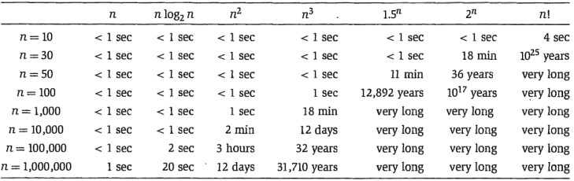

# Algorithm Analysis

## [Sorting Algorithms](SortingAlgorithms.md)

* Simple sorts
  * Insertion sort
  * Selection sort
* Efficient sorts
  * Merge sort
  * Heapsort
  * Quicksort
  * Shellsort
* Bubble sort and variants
  * Bubble sort
  * Comb sort
* Distribution sort
  * Counting sort
  * Bucket sort
  * Radix sort

## Search Algorithms

| Algorithm                  | Description | Run Time |
| -------------------------- | ----------- | -------- |
| Binary Search              |
| Depth/Breadth First Search |

## Hashing

* Hash lookup is currently the most widely used technique to find appropriate data by key or ID. We access data by its index.
* The data structure is referred as Hash-Map or Hash-Table or Dictionary that maps keys to values, efficiently. We can perform value lookups using keys. Idea is to use an appropriate hash function which does the key -> value mapping.

## Exponentiation by Squaring

* Exponentiation by squaring or Binary exponentiation is a general method for fast computation of large positive integer powers of a number in O(log2N). Not only this, the method is also used for computation of powers of polynomials and square matrices.

## String Matching and Parsing

* Pattern matching/searching is one of the most important problem in Computer Science.
* KMP Algorithm (String Matching)
  * Knuth-Morris-Pratt algorithm is used in cases where we have to match a short pattern in a long string. For instance, when we Ctrl+F a keyword in a document, we perform pattern matching in the whole document.
* Regular Expression (String Parsing)
  * Many a times we have to validate a string by parsing over a predefined restriction. It is heavily used in web development for URL parsing and matching.

## Orders of Growth

| O                | Description                                                                                                                                                                                    | Notes                                                                                                                                                                               |
| ---------------- | ---------------------------------------------------------------------------------------------------------------------------------------------------------------------------------------------- | ----------------------------------------------------------------------------------------------------------------------------------------------------------------------------------- |
| O(1)             | Describes an algorithm that will always execute in the same time (or space) regardless of the size of the input data set                                                                       |
| O(n)             | Describes an algorithm whose performance will grow linearly and in direct proportion to the size of the input data set                                                                         |
| O(n<sup>2</sup>) | Represents an algorithm whose performance is directly proportional to the square of the size of the input data set                                                                             | This is common with algorithms that involve nested iterations over the data set                                                                                                     |
| O(2n)            | Denotes an algorithm whose growth doubles with each addition to the input data set. The growth curve of an O(2N) function is exponential - starting off very shallow, then rising meteorically |
| O(log n)         | Iterative halving of data sets described in the binary search example produces a growth curve that peaks at the beginning and slowly flattens out as the size of the data sets increase        | An input data set containing 10 items takes one second to complete, a data set containing 100 items takes two seconds, and a data set containing 1000 items will take three seconds |



## Master's Theorem

Let a ≥ 1, b ≥ 2, and c > 0 and suppose that T(n) is a function on the non-negative integers that satisfies the recurrence

$T(n) = aT(n/b) + f(n)$ with $T(0) = 0$ and $T(1) = \theta(1)$

where n/b means either ⌊n/b⌋or ⌈n/b⌉

* a ≥ 1 is the number of subproblems
* b ≥ 2is the factor by which the subproblem size decreases
* f(n) ≥ 0 is the work to divide and combine subproblems  

>Case 1: If c < log<sub>b</sub>a, then T(n) = Θ(n<sup>log<sub>b</sub>a</sup>)  
>Case 2: If c = log<sub>b</sub>a, then T(n) = Θ(n<sup>c</sup>log n)  
>Case 3: If c > log<sub>b</sub>a,then T(n) = Θ(n<sup>c</sup>)

## Algorithmic Paradigms

* Greedy: Build up a solution incrementally, myopically optimizing some local criterion
* Divide-and-Conquer: Break up a problem into independent subproblems; solve each subproblem; combine solutions to subproblems to form solution to original problem
* Dynamic Programming: Break up a problem into a series of overlapping subproblems; combine solutions to smaller subproblems to form solution to large subproblem

## Algorithm Examples

### [Binary Search](https://www.geeksforgeeks.org/binary-search/)

Given a sorted array arr[] of n elements, write a function to search a given element x in arr[].

Binary Search: Search a sorted array by repeatedly dividing the search interval in half. Begin with an interval covering the whole array. If the value of the search key is less than the item in the middle of the interval, narrow the interval to the lower half. Otherwise narrow it to the upper half. Repeatedly check until the value is found or the interval is empty.

```Python
# Python Program for recursive binary search. 

# Returns index of x in arr if present, else -1 
def binarySearch (arr, l, r, x): 

    # Check base case 
    if r >= l: 
        mid = l + (r - l)/2

    # If element is present at the middle itself 
    if arr[mid] == x: 
        return mid 

    # If element is smaller than mid, then it  
    # can only be present in left subarray 
    elif arr[mid] > x: 
        return binarySearch(arr, l, mid-1, x) 

    # Else the element can only be present 
    # in right subarray 
    else: 
        return binarySearch(arr, mid + 1, r, x) 

    else: 
    # Element is not present in the array 
        return -1

    # Test array 
    arr = [ 2, 3, 4, 10, 40 ] 
    x = 10

    # Function call 
    result = binarySearch(arr, 0, len(arr)-1, x) 

if result != -1:
    print "Element is present at index % d" % result
else:
    print "Element is not present in array"
```

## References

**[rob-bell](https://rob-bell.net/2009/06/a-beginners-guide-to-big-o-notation/)**  
**[Algorithm Analysis](https://www.geeksforgeeks.org/fundamentals-of-algorithms/#AnalysisofAlgorithms)**  
**[Big O Cheat Sheet](http://bigocheatsheet.com/)**  
**[Algorithm Analysis](https://www.cs.princeton.edu/~wayne/kleinberg-tardos/pdf/02AlgorithmAnalysis.pdf)**  
**[Master's Theorem](https://www.cs.princeton.edu/~wayne/kleinberg-tardos/pdf/05DivideAndConquerII.pdf)**
