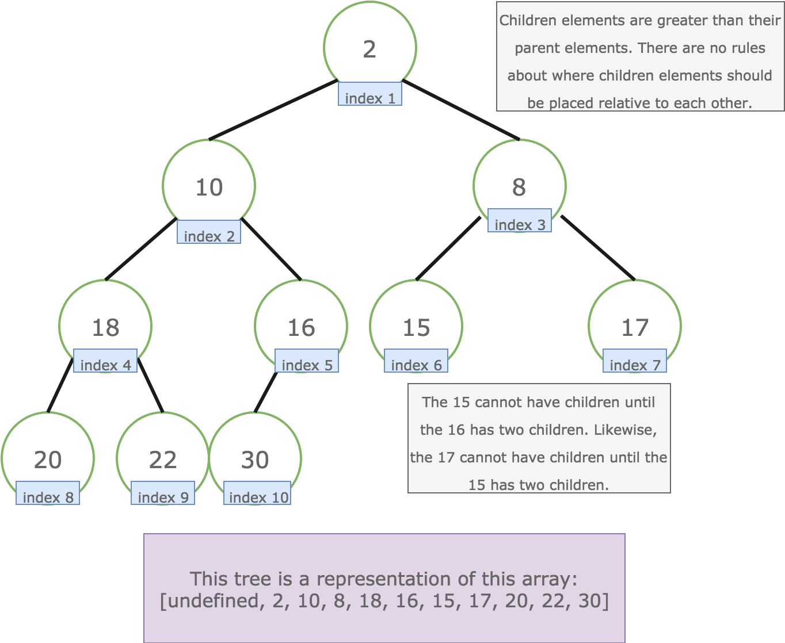
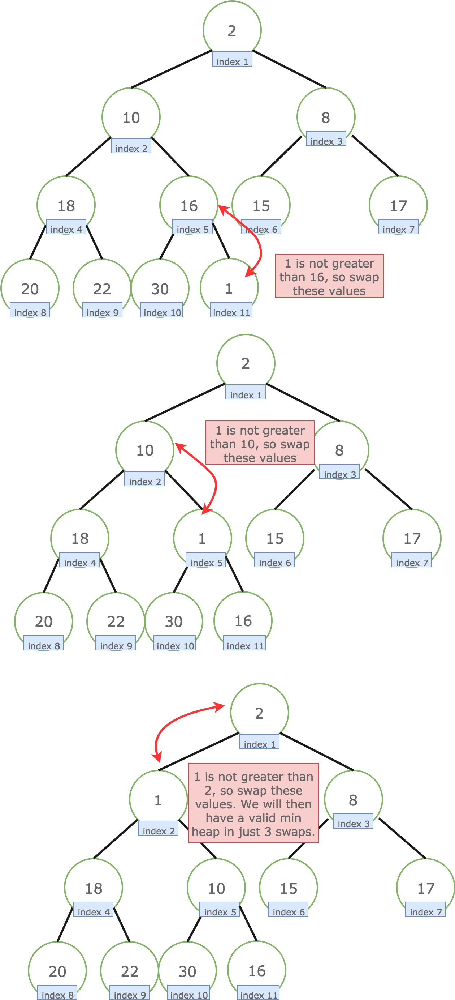

# Data Structures

## Arrays

* An array is a number of elements in a specific order, typically all of the same type (depending on the language, individual elements may either all be forced to be the same type, or may be of almost any type). Elements are accessed using an integer index to specify which element is required. Typical implementations allocate contiguous memory words for the elements of arrays (but this is not always a necessity). Arrays may be fixed-length or resizable.

|                |      |                                                                                                                     |
| -------------- | ---- | ------------------------------------------------------------------------------------------------------------------- |
| Accessing Time | O(1) | This is possible because elements are stored at contiguous locations                                                |
| Search Time    | O(n) | For Sequential Search: O(log n) for Binary Search (If Array is sorted)                                              |
| Insertion Time | O(n) | The worst case occurs when insertion happens at the Beginning of an array and requires shifting all of the elements |
| Deletion Time  | O(n) | The worst case occurs when deletion happens at the Beginning of an array and requires shifting all of the elements  |

> Let size of array be n.

### Array Example

Let us say, we want to store marks of all students in a class, we can use an array to store them. This helps in reducing the use of number of variables as we don’t need to create a separate variable for marks of every subject. All marks can be accessed by simply traversing the array.

## Linked List

* A linked list (also just called list) is a linear collection of data elements of any type, called nodes, where each node has itself a value, and points to the next node in the linked list. The principal advantage of a linked list over an array, is that values can always be efficiently inserted and removed without relocating the rest of the list. Certain other operations, such as random access to a certain element, are however slower on lists than on arrays.

1. **Singly Linked List**: In this type of linked list, every node stores address or reference of next node in list and the last node has next address or reference as NULL. Eg. 1->2->3->4->NULL
2. **Doubly Linked List**: In this type of Linked list, there are two references associated with each node, One of the reference points to the next node and one to the previous node. Advantage of this data structure is that we can traverse in both the directions and for deletion we don’t need to have explicit access to previous node. Eg. NULL<-1<->2<->3->NULL
3. **Circular Linked List**: Circular linked list is a linked list where all nodes are connected to form a circle. There is no NULL at the end. A circular linked list can be a singly circular linked list or doubly circular linked list. Advantage of this data structure is that any node can be made as starting node. This is useful in implementation of circular queue in linked list. Eg. 1->2->3->1 [The next pointer of last node is pointing to the first]

|                              |      |                                                              |
| ---------------------------- | ---- | ------------------------------------------------------------ |
| Accessing time of an element | O(n) |
| Search time of an element    | O(n) |
| Insertion of an Element      | O(1) | If we are at the position where we have to insert an element |
| Deletion of an Element       | O(1) | If we know address of node previous the node to be deleted   |

### Linked List Example

Consider the previous example where we made an array of marks of student. Now if a new subject is added in the course, its marks also to be added in the array of marks. But the size of the array was fixed and it is already full so it can not add any new element. If we make an array of a size lot more than the number of subjects it is possible that most of the array will remain empty. We reduce the space wastage Linked List is formed which adds a node only when a new element is introduced. Insertions and deletions also become easier with linked list.  
One big drawback of linked list is, random access is not allowed. With arrays, we can access i’th element in O(1) time. In linked list, it takes Θ(i) time.

## Stack

* Stack is a linear data structure which follows a particular order in which the operations are performed. The order may be LIFO (Last In First Out) or FILO (First In Last Out).
* A stack or LIFO (last in, first out) is an abstract data type that serves as a collection of elements, with two principal operations: push, which adds an element to the collection, and pop, which removes the last element that was added. In stack both the operations of push and pop takes place at the same end that is top of the stack. It can be implemented by using both array and linked list.

|             |                   |
| ----------- | ----------------- |
| Insertion   | O(1)              |
| Deletion    | O(1)              |
| Access Time | O(n) [Worst Case] |

*Insertion and Deletion are allowed on one end*

### Stack Example

Stacks are used for maintaining function calls (the last called function must finish execution first), we can always remove recursion with the help of stacks. Stacks are also used in cases where we have to reverse a word, check for balanced parenthesis and in editors where the word you typed the last is the first to be removed when you use undo operation. Similarly, to implement back functionality in web browsers.

## Queue

* A Queue is a linear structure which follows a particular order in which the operations are performed. The order is First In First Out (FIFO). A good example of a queue is any queue of consumers for a resource where the consumer that came first is served first. The difference between stacks and queues is in removing. In a stack we remove the item the most recently added; in a queue, we remove the item the least recently added.
* A queue or FIFO (first in, first out) is an abstract data type that serves as a collection of elements, with two principal operations: enqueue, the process of adding an element to the collection.(The element is added from the rear side) and dequeue, the process of removing the first element that was added. (The element is removed from the front side). It can be implemented by using both array and linked list.
* **Circular Queue**: The advantage of this data structure is that it reduces wastage of space in case of array implementation, As the insertion of the (n+1)’th element is done at the 0’th index if it is empty.

|             |                   |
| ----------- | ----------------- |
| Insertion   | O(1)              |
| Deletion    | O(1)              |
| Access Time | O(n) [Worst Case] |

### Queue Example

Queue as the name says is the data structure built according to the queues of bus stop or train where the person who is standing in the front of the queue(standing for the longest time) is the first one to get the ticket. So any situation where resources are shared among multiple users and served on first come first server basis. Examples include CPU scheduling, Disk Scheduling. Another application of queue is when data is transferred asynchronously (data not necessarily received at same rate as sent) between two processes. Examples include IO Buffers, pipes, file IO, etc.

## Binary Tree

* A tree whose elements have at most 2 children is called a binary tree. Since each element in a binary tree can have only 2 children, we typically name them the left and right child.
* A Binary Tree node contains following parts.
  * Data
  * Pointer to left child
  * Pointer to right child

### Binary Tree Example

One reason to use binary tree or tree in general is for the things that form a hierarchy. They are useful in File structures where each file is located in a particular directory and there is a specific hierarchy associated with files and directories. Another example where Trees are useful is storing hierarchical objects like JavaScript Document Object Model considers HTML page as a tree with nesting of tags as parent child relations.

## Binary Search Tree

* Binary Search Tree is a node-based binary tree data structure which has the following properties:
  * The left subtree of a node contains only nodes with keys lesser than the node’s key.
  * The right subtree of a node contains only nodes with keys greater than the node’s key.
  * The left and right subtree each must also be a binary search tree.
* A Binary Tree can be traversed in two ways:
  * Depth First Traversal:
    * Inorder (Left-Root-Right)
    * Preorder (Root-Left-Right)
    * Postorder (Left-Right-Root)
  * Breadth First Traversal: Level Order Traversal
* Binary Tree Properties:
  * The maximum number of nodes at level ‘l’ = 2l-1.
  * Maximum number of nodes = 2h – 1.
    * Here h is height of a tree. Height is considered as is maximum number of nodes on root to leaf path
  * Minimum possible height =  ceil(Log2(n+1))
  * In Binary tree, number of leaf nodes is always one more than nodes with two children.
  * Time Complexity of Tree Traversal: O(n)
* BST provide moderate access/search (quicker than Linked List and slower than arrays).
* BST provide moderate insertion/deletion (quicker than Arrays and slower than Linked Lists).

Time Complexities:

|             |                   |
| ----------- | ----------------- |
| Search      | O(h)              |
| Insertion   | O(h)              |
| Deletion    | O(h)              |
| Extra Space | O(n) for pointers |

> h: Height of BST  
> n: Number of nodes in BST  
> If Binary Search Tree is Height Balanced, then h = O(Log n)  
> Self-Balancing BSTs such as AVL Tree, Red-Black Tree and Splay Tree make sure that height of BST remains O(Log n)

### BST Example

Its main use is in search application where data is constantly entering/leaving and data needs to printed in sorted order. For example in implementation in E- commerce websites where a new product is added or product goes out of stock and all products are listed in sorted order.

## Binary Heap

* It’s a complete tree (All levels are completely filled except possibly the last level and the last level has all keys as left as possible). This property of Binary Heap makes them suitable to be stored in an array.
* A Heap is a special Tree-based data structure in which the tree is a complete binary tree. Generally, Heaps can be of two types:
  * Max-Heap: In a Max-Heap the key present at the root node must be greatest among the keys present at all of it’s children. The same property must be recursively true for all sub-trees in that Binary Tree.
  * Min-Heap: In a Min-Heap the key present at the root node must be minimum among the keys present at all of it’s children. The same property must be recursively true for all sub-trees in that Binary Tree.
* The Heap data structure can be used to efficiently find the k smallest (or largest) elements in an array, merging k sorted arrays, median of a stream, etc.
* Heap is a special data structure and it cannot be used for searching of a particular element.

|                          |                                        |
| ------------------------ | -------------------------------------- |
| Get Minimum in Min Heap  | O(1) [Or Get Max in Max Heap]          |
| Extract Minimum Min Heap | O(Log n) [Or Extract Max in Max Heap]  |
| Decrease Key in Min Heap | O(Log n)  [Or Extract Max in Max Heap] |
| Insert                   | O(Log n)                               |
| Delete                   | O(Log n)                               |

### Binary Heap Example

Used in implementing efficient priority-queues, which in turn are used for scheduling processes in operating systems. Priority Queues are also used in Djikstra’s and Prim’s graph algorithms.  
The Heap data structure can be used to efficiently find the k smallest (or largest) elements in an array, merging k sorted arrays, median of a stream, etc.  
Heap is a special data structure and it cannot be used for searching of a particular element.

## Min Heap

A heap is a collection of values that is somewhat ordered. We could order them so that the maximum value is always easily available (a max heap) or we could make the minimum value easily available (min heap).



Follow these guidelines when making a min heap:

* Visualize the minimum value as being at the top of the tree. (A max heap would put the maximum value at the top).
* Each element may have up to two children.
* Children elements `must be greater than their parent element`. However, there are no rules about how children should be placed relative to each other. For example, the smaller of the two children could be to the left or to the right.
* There are `no holes` in a heap. Visualize heaps as being filled from top to bottom and left to right. An element cannot have children until all the elements to the left and above have two children each.
* The tree is just a way to visualize the different indices of an array. The top of the tree is index 1. The next layer contains indices 2 and 3. The third layer contains indices 4, 5, 6, and 7, and so forth.
* `Do not use index 0 when making a heap!`

If we know the index of a parent element, we should be able to easily locate the children elements with simple math! The first child's index is twice the parent's index, and the second child's index is twice the parent's index plus 1. Likewise, if we know the index of a child element, we should be able to easily locate the parent! Just divide the child's index by 2 and eliminate any decimal that may result. Of course, this math would not work if we were using index 0, which is why we may not use that space in the array. As you can see in the diagram above, the array is not sorted. However, we do not need it to be sorted. We are only interested in keeping the minimum value at index 1. The rest of the heap is organized just enough so that we may keep the minimum value at index 1 with little effort.

```JS
child1_index = parent_index * 2
child2_index = parent_index * 2 + 1
parent_index = Math.trunc(child_index / 2)
```

### Adding to a Min Heap

Using the min heap given above, let's say that we wanted to add the number 18 to our heap. Since it's an array, we can easily add it to the array using the `.push()` method, which would place it at index 11. Then, we only need to ask ourselves if it is following the rules of the min heap - in other words, is our added value greater than its parent? 18 is greater than 16, so we're done! We successfully added the 18 to our heap. However, let's say we wanted to add the number 1 to our heap, not the 18. At that point, 1 is not greater than the parent, 16, so what we need to do is "swim up" the 1. We do that by swapping it with its parent until it finds a position where it is greater than the parent or until it becomes the top of the tree. Notice that by adding a 1 to our min heap, it will only take 3 swaps to place the 1 at the top of the tree. Only a few elements in the array need to be moved, which means our time complexity is very low compared to maintaining a fully sorted array.




## Hashing

* Hashing is an important Data Structure which is designed to use a special function called the Hash function which is used to map a given value with a particular key for faster access of elements. The efficiency of mapping depends of the efficiency of the hash function used.
* Hash Function: a hash function maps a big number or string to a small integer that can be used as index in hash table.
  * Efficiently computable.
  * Should uniformly distribute the keys (Each table position equally likely for each key)
* Hash Table: an array that stores pointers to records corresponding to a given entry. An entry in hash table is NIL if no existing data has hash function value equal to the index for the entry.
* Collision Handling: Since a hash function gets us a small number for a big key, there is possibility that two keys result in same value. The situation where a newly inserted key maps to an already occupied slot in hash table is called collision and must be handled using some collision handling technique. Following are the ways to handle collisions:
  * Chaining:The idea is to make each cell of hash table point to a linked list of records that have same hash function value. Chaining is simple, but requires additional memory outside the table.
  * Open Addressing: In open addressing, all elements are stored in the hash table itself. Each table entry contains either a record or NIL. When searching for an element, we one by one examine table slots until the desired element is found or it is clear that the element is not in the table.
* Hashing seems better than BST for all the operations. But in hashing, elements are unordered and in BST elements are stored in an ordered manner. Also BST is easy to implement but hash functions can sometimes be very complex to generate. In BST, we can also efficiently find floor and ceil of values.

|           |                                     |
| --------- | ----------------------------------- |
| Space     | O(n)                                |
| Search    | O(1) [Average]    O(n) [Worst case] |
| Insertion | O(1) [Average]    O(n) [Worst Case] |
| Deletion  | O(1) [Average]    O(n) [Worst Case] |

### Hashing Example

Hashing can be used to remove duplicates from a set of elements. Can also be used find frequency of all items. For example, in web browsers, we can check visited urls using hashing. In firewalls, we can use hashing to detect spam. We need to hash IP addresses. Hashing can be used in any situation where want search() insert() and delete() in O(1) time.

## Graph

* A Graph is a non-linear data structure consisting of nodes and edges. The nodes are sometimes also referred to as vertices and the edges are lines or arcs that connect any two nodes in the graph.
* Graph is a data structure that consists of following two components:
  * A finite set of vertices also called as nodes.
  * A finite set of ordered pair of the form (u, v) called as edge. The pair is ordered because (u, v) is not same as (v, u) in case of directed graph(di-graph). The pair of form (u, v) indicates that there is an edge from vertex u to vertex v. The edges may contain weight/value/cost.
* Graph can be classified on the basis of many things, below are the two most common classifications :
  * Direction :
    * Undirected Graph : The graph in which all the edges are bidirectional.Directed Graph : The graph in which all the edges are unidirectional.
  * Weight :
    * Weighted Graph : The Graph in which weight is associated with the edges.Unweighted Graph : The Graph in which their is no weight associated to the edges.

> V -> Number of Vertices  
> E -> Number of Edges

Time Complexities in case of Adjacency Matrix:

|           |                        |
| --------- | ---------------------- |
| Traversal | (By BFS or DFS) O(V^2) |
| Space     | O(V^2)                 |

Time Complexities in case of Adjacency List:

|           |                          |
| --------- | ------------------------ |
| Traversal | (By BFS or DFS) O(ElogV) |
| Space     | O(V+E)                   |

### Graph Example

The most common example of the graph is to find shortest path in any network. Used in google maps or bing. Another common use application of graph are social networking websites where the friend suggestion depends on number of intermediate suggestions and other things.

## Matrix

* A matrix represents a collection of numbers arranged in an order of rows and columns. It is necessary to enclose the elements of a matrix in parentheses or brackets.

## Trie

* Trie is an efficient data structure for searching words in dictionaries, search complexity with Trie is linear in terms of word (or key) length to be searched. If we store keys in binary search tree, a well balanced BST will need time proportional to M * log N, where M is maximum string length and N is number of keys in tree. Using trie, we can search the key in O(M) time. So it is much faster than BST.
* Hashing also provides word search in O(n) time on average. But the advantages of Trie are there are no collisions (like hashing) so worst case time complexity is O(n). Also, the most important thing is Prefix Search. With Trie, we can find all words beginning with a prefix (This is not possible with Hashing). The only problem with Tries is they require a lot of extra space. Tries are also known as radix tree or prefix tree.

|               |                                                                                                                                         |
| ------------- | --------------------------------------------------------------------------------------------------------------------------------------- |
| Insert time   | O(M) where M is the length of the string.                                                                                               |
| Search time   | O(M) where M is the length of the string.                                                                                               |
| Space         | O(ALPHABET_SIZE * M * N) where N is number of keys in trie, ALPHABET_SIZE is 26 if we are only considering upper case Latin characters. |
| Deletion time | O(M)                                                                                                                                    |

### Trie Example

The most common use of Tries is to implement dictionaries due to prefix search capability. Tries are also well suited for implementing approximate matching algorithms, including those used in spell checking. It is also used for searching Contact from Mobile Contact list OR Phone Directory.

## Segment Tree

* This data structure is usually implemented when there are a lot of queries on a set of values. These queries involve minimum, maximum, sum, .. etc on a input range of given set. Queries also involve updating values in given set. Segment Trees are implemented using array.

|                              |                            |
| ---------------------------- | -------------------------- |
| Construction of segment tree | O(N)                       |
| Query                        | O(log N)                   |
| Update                       | O(log N)                   |
| Space                        | O(N) [Exact space = 2*N-1] |

### Segment Tree Example

It is used when we need to find Maximum/Minimum/Sum/Product of numbers in a range.

## References

**[Data Structures Geeks for Geeks](https://www.geeksforgeeks.org/data-structures/)**  
**[Wikipedia](https://en.wikipedia.org/wiki/List_of_data_structures)**
