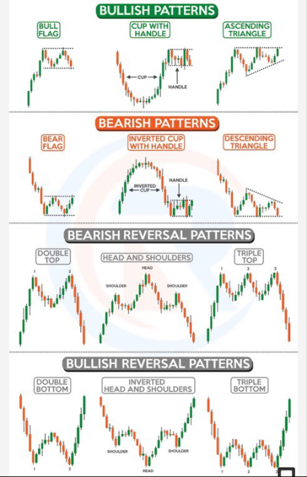
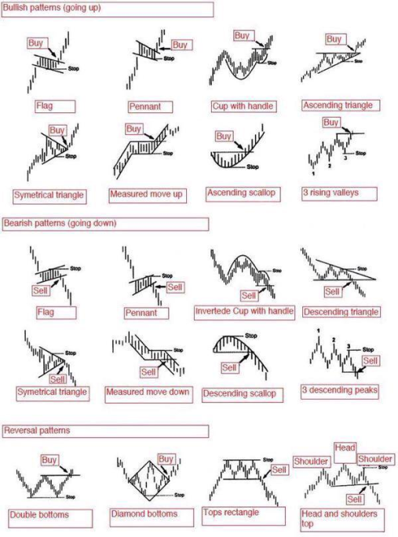
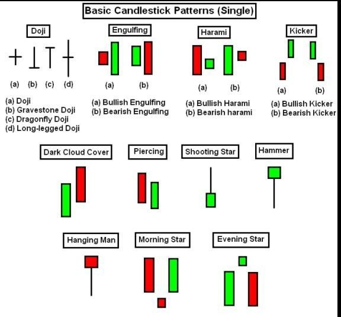

# Finance

## General

https://www.timothysykes.com/blog/trading-terms-you-need-to-know/

| Term                          | Definition | Link |
| ----------------------------- | ---------- | ---- |
| Bear Market                   |            |
| Bull Market                   |            |
| Blue Chip Stocks              |            |
| Bid                           |            |
| Close                         |            |
| Day Trading                   |            |
| Dividend                      |            |
| High                          |            |
| Index                         |            |
| Initial Public Offering (IPO) |            |
| Margin                        |            |
| Open                          |            |
| Order                         |            |
| Sector                        |            |
| Short Selling                 |            |
| Volatility                    |            |
| Volume                        |            |
| Yield                         |            |
| Market Capitlization          |            |
| After Hours                   |            |
| Buy Rating                    |            |
|                               |            |
|                               |            |
|                               |            |
|                               |            |

## Candlestick Analysis

## Options

## Chart Analysis

| Term            | Definition                                                                                                                                                                                                                                                                                                                                                                                                                                                                                                                                                                                                                                                                                                                                                                                                                                                                                                                          | Link |
| --------------- | ----------------------------------------------------------------------------------------------------------------------------------------------------------------------------------------------------------------------------------------------------------------------------------------------------------------------------------------------------------------------------------------------------------------------------------------------------------------------------------------------------------------------------------------------------------------------------------------------------------------------------------------------------------------------------------------------------------------------------------------------------------------------------------------------------------------------------------------------------------------------------------------------------------------------------------- | ---- |
| Bollinger Bands | These bands can indicate a stock’s volatility. Bollinger Bands drape around prices like a channel, with an upper band and a lower band. Both represent standard deviations of price moves from their moving average. So a one-standard-deviation Bollinger Band means the bands cover 68% of price bars. Bollinger Bands of two standard deviations cover 95% of price bars, and so on. When you overlay two-standard-deviation Bollinger Bands on price bars, it means if price falls outside the bands, statistically they should stay outside the bands only about 5% of the time.                                                                                                                                                                                                                                                                                                                                               |
| MACD            | **Moving average convergence/divergence**. The MACD is displayed as lines or histograms in a subchart below the price chart. The MACD provides three signals—a trend signal, divergence signal, and timing signal. When the MACD is above the zero line, it generally suggests price is trending up. When it’s below the zero line, it suggests a downtrend. Crossovers can also be used to indicate uptrends and downtrends. When the MACD crosses above its signal line, prices are in an uptrend. The opposite is true for downtrends.  There’s another way you might use MACD—for divergence signals. That’s when price moves in one direction, but MACD moves in the opposite direction. A divergence could signal a potential trend change. But when will that change happen, and will it be a correction or a reversal? You may never get a perfect answer. But to get a possible idea, use the SMA and MACD together. |
| RSI             | **Relative Strength**. RSI looks at the strength of price relative to its closing price. It measures a security’s speed and the change in its price movements. A 10-period RSI will look at the prevailing closing price relative to the closing price of the prior 10 days. Like stochastics, RSI has overbought/oversold threshold levels—70 and 30, by default.                                                                                                                                                                                                                                                                                                                                                                                                                                                                                                                                                                  |
| SMA             | **Simple Moving Average**. It’s the line that goes through prices to show the general price movement. An average of past closing prices. So, if you use a 50-day SMA, you’re looking at the average of the past 50 days. If you use a 20-week SMA, you’re seeing the average of the last 20 weeks.  The SMA’s main objective is to identify if price is in a possible trend and the trend’s direction. A quick glance at a chart can help answer those questions. In figure 1, it’s clear when a trend is going up or down. Remember, a trend can reverse at any time without notice.                                                                                                                                                                                                                                                                                                                                         |

### Reading Charts

* To see how this all works, suppose you select an indicator from each category—MACD for trend, RSI for momentum, and Bollinger Bands for trend reversal.

## Images

## Resources

[chart indicators](https://tickertape.tdameritrade.com/trading/three-indicators-to-check-before-the-trade-16986)