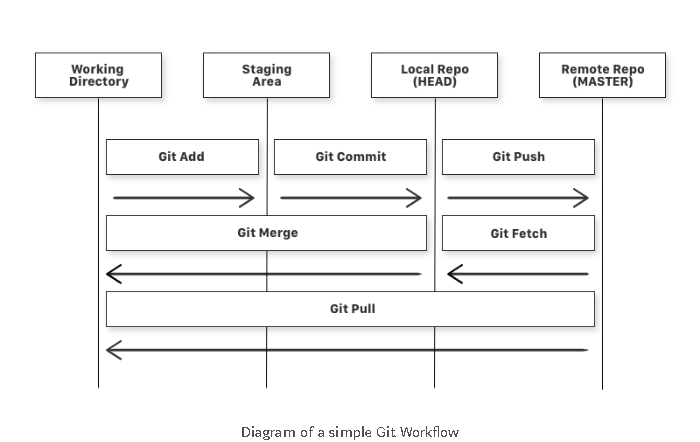

# Git

* [Syncing a Fork](https://help.github.com/articles/syncing-a-fork/)

Git is a version control system for managing your source code history.
GitHub is a hosting service for your Git repositories.

## Create a New Repository on the Command Line

`git init`  
`git add .`  
`git commit -m "initial commit"`  
`git remote add origin https://github.com/ccasil/repo-name.git`  
`git push -u origin master`  
>The name of our remote is origin and the default local branch name is master

## Merging Branches

`git checkout master`  
`git merge {{branch name}}`
>Merge branch with current branch (master)

## Pulling to Overwrite Local Files

* [Stack Overflow](https://stackoverflow.com/questions/1125968/how-do-i-force-git-pull-to-overwrite-local-files)

`git fetch --all`  
`git reset --hard origin/{{branch_name}}`  
`git pull origin master`

## Merge Conflicts

| Step | Command      | Description                                 |
| ---- | ------------ | ------------------------------------------- |
| 1    | `git status` | Shows which file resulted to merge conflict |
| 2    |              | Check file for indicators (<<<, ===, >>>)   |

## Push to an Existing Repository from the Command Line

`git add .`  
`git commit -m "initial commit"`  
`git push -u origin master`  

| Command                                                                    | Notes                                                                                                                                               |
| -------------------------------------------------------------------------- | --------------------------------------------------------------------------------------------------------------------------------------------------- |
| `git add .`                                                                | Add files to the staging area                                                                                                                       |
| `git commit -m " "`                                                        | Add files to the staging area with a message                                                                                                        |
| `git push`                                                                 | Upload local repository content to a remote repository                                                                                              |
| `git init`                                                                 | Turn current directory into an empty Git repository                                                                                                 |
| `git status`                                                               | Check status of files in directory                                                                                                                  |
| `git fetch`                                                                | Get files from the remote repository to the local repository but not into the working directory                                                     |
| `git merge`                                                                | Get the files from the local repository into the working directory                                                                                  |
| `git log`                                                                  | See history of commits                                                                                                                              |
| `git clone  <https://github.com/ccasil/Tips-and-Templates.git>`            | Download (clone) a remote repository                                                                                                                |
| `git remote add origin <https://github.com/ccasil/Tips-and-Templates.git>` | Connect an already initialized local repository to the remote one                                                                                   |
| `git pull origin master`                                                   | Check for changes on our GitHub repository and pull down any new changes                                                                            |
| `git diff HEAD`                                                            | Check within the files that have already been staged what is different from our last commit                                                         |
| `git reset HEAD~1`                                                         | Remove most recent commit                                                                                                                           |
| `git reset 'file name'`                                                    | Removes file from staged status                                                                                                                     |
| `git checkout --'file name'`                                               | Reset the file to the latest committed version                                                                                                      |
| `git branch -a`                                                            | List current branch and all available branches                                                                                                      |
| `git branch 'branch name'`                                                 | Create a new branch                                                                                                                                 |
| `git checkout 'branch name'`                                               | Switch the the branch                                                                                                                               |
| `git stash`                                                                | Temporarily caches any changes you've made to your working copy (Takes uncommitted changes, both staged and unstaged, and saves them for later use) |
| `git stash pop` / `git stash apply`                                        | Reapply stashed changes (pop: remove stashed changes from stashed state; apply: applies the same stashed changes to multiple branches)              |
| `git rm`                                                                   | Remove actual files from disk and stage the removal of files                                                                                        |
| `git branch -d 'branch name'`                                              | Remove a branch                                                                                                                                     |

## Shortcuts

| Command                         | Notes                             |
| ------------------------------- | --------------------------------- |
| `git checkout -b 'branch name'` | Create and switch to a new branch |

## References

**[freeCodeCamp](https://medium.freecodecamp.org/learn-the-basics-of-git-in-under-10-minutes-da548267cc91?fbclid=IwAR26svmMfO4MK4iWiqYpepnZm3zRy1_VeXwmu5wjgP-0iwecib-b3iwNdfg)**  
**[gitignore](https://git-scm.com/docs/gitignore)**