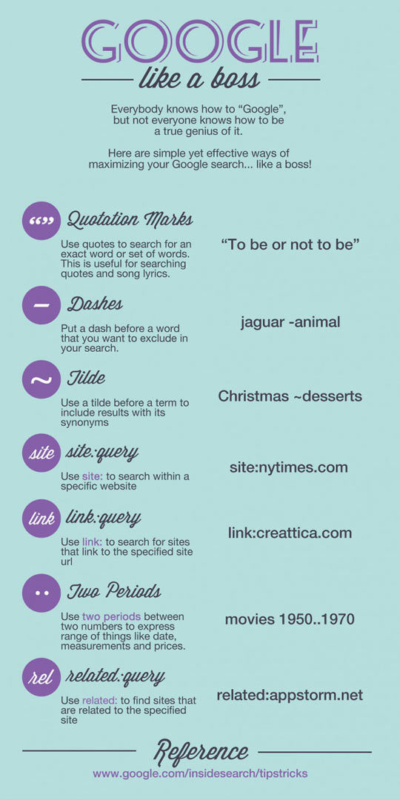

# Google

| Tool               | Example                | Description                                                                                       |
| ------------------ | ---------------------- | ------------------------------------------------------------------------------------------------- |
| "" Quotation Marks | `"To be or not to be"` | Use quotes to search for an exact word or set of words                                            |
| \- Dashes          | `jaguar -animal`       | Put a dash before a word that you want to exclude in your search                                  |
| ~ Tilde            | `Christmas ~desserts`  | Use a tilde before a term to include results with its synonyms                                    |
| site:query         | `site:nytimes.com`     | User site: to search within a specific website                                                    |
| link:query         | `link:cesarkylecail.me`           | Use link: to search for sites that link to the specific site url                                  |
| .. Two Periods     | `movies 1950..1970`    | Use two periods between two numbers to express range of things like date, measurements and prices |
| related:query      | `related:linkedin.com` | Use related: to find sites that are related to the specified site                                 |

## References

**[Google](www.google.com)**
