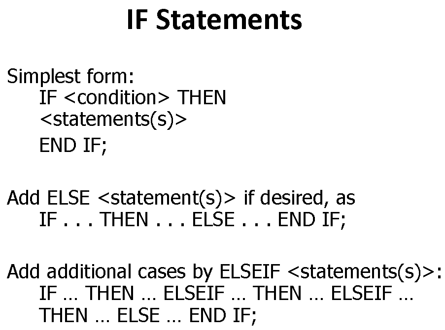
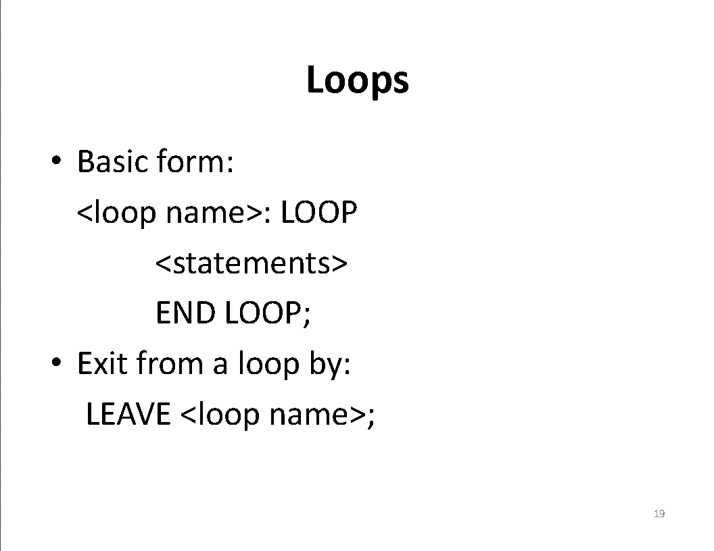
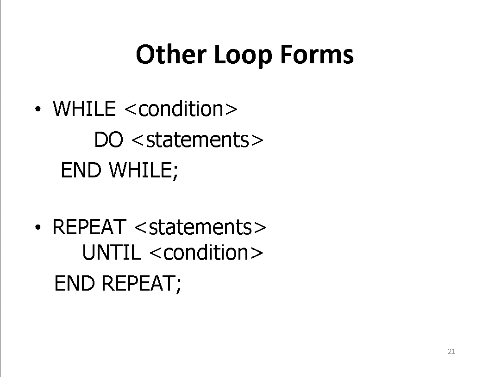
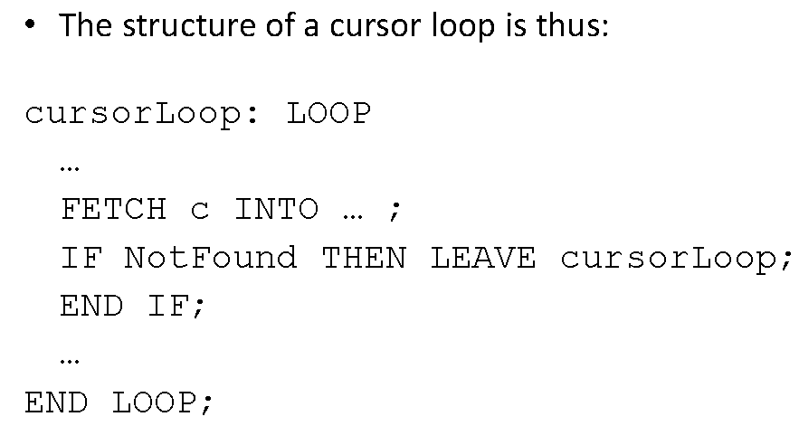
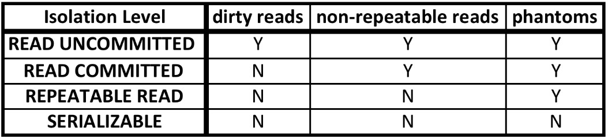
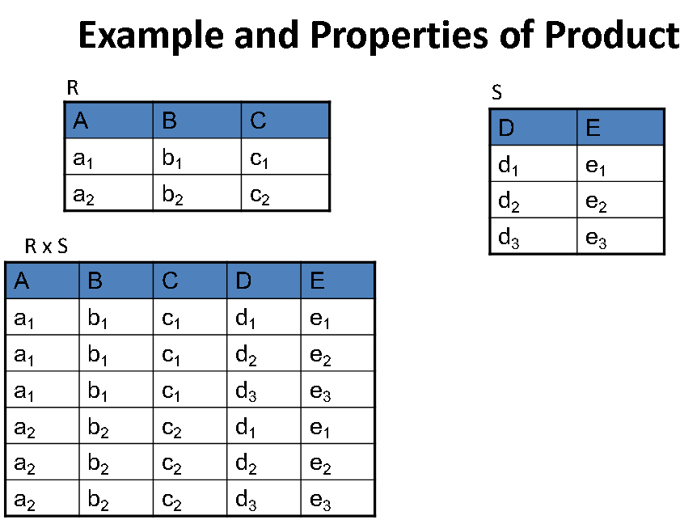
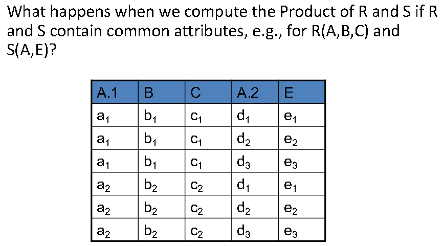
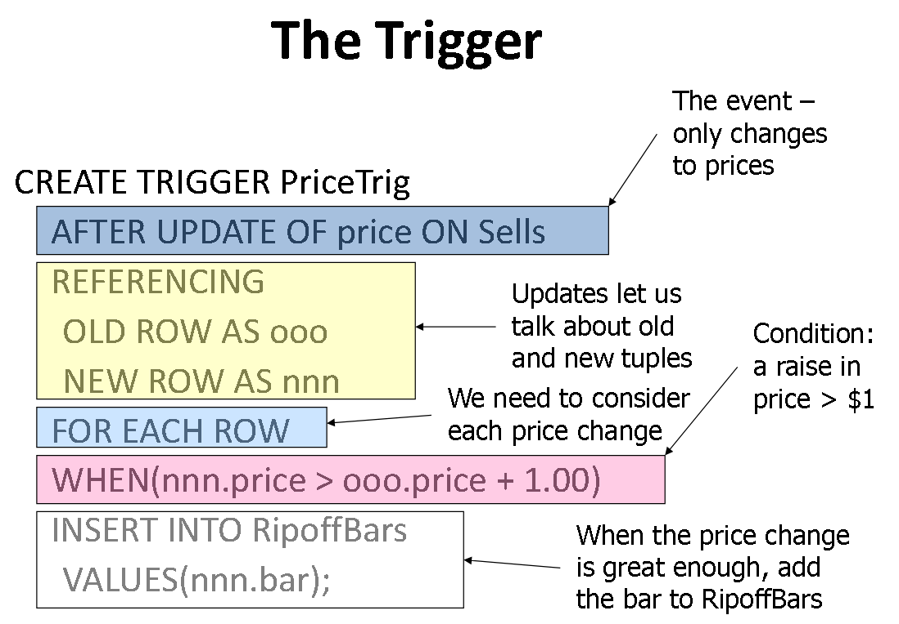
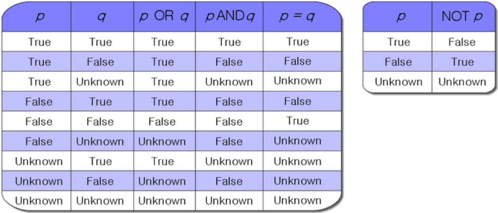

# PostgreSQL

__[PostgreSQL Official](https://www.postgresql.org/docs/)__

## Schema

| Query                                              | Function                                               |
| -------------------------------------------------- | ------------------------------------------------------ |
| `CREATE SCHEMA myschema;`                          | Create schema named myschema                           |
| `ALTER ROLE username SET SEARCH_PATH TO myschema;` | To set the default schema, you modify your search path |
| `SHOW SEARCH_PATH;`                                | Verify your search path                                |
| `DROP SCHEMA myschema CASCADE;`                    | Drop a schema myschema                                 |

## Tables  

| Query                                               | Function                                                                                                                                                                                                  |
| --------------------------------------------------- | --------------------------------------------------------------------------------------------------------------------------------------------------------------------------------------------------------- |
| `CREATE TABLE ();`                                  | Create Tables [Data Types](http://www.postgresqltutorial.com/postgresql-data-types/)                                                                                                                   |
| `DROP TABLE tablename`                              | Drop table from schema                                                                                                                                                                                    |
| `DELETE FROM tablename;`                            | Get rid of all tuples in tablename without deleting the table itself                                                                                                                                      |
| `ALTER TABLE tablename ADD attribute DATATYPE(#);`  | Adds attribute 'attribute' with type DATATYPE(#) to the table 'tablename'                                                                                                                                 |
| `ALTER TABLE tablename DROP attribute;`             | Drops attribute from tablename                                                                                                                                                                            |
| `COPY attributes FROM stdin USING DELIMETERS "\|";` | Populate tables using "\|" as a delimeter                                                                                                                                                                 |
| `PRIMARY KEY`                                       | Can not be null, rows are uniquely identified by primary key value, can be at most one primary key for a table                                                                                            |
| `UNIQUE`                                            | Rows can contain NULL unique values, rows with non-null unique values are uniquely identified by the unique values values, can have multiple unique constraints for a table, in addition to a primary key |

## Queries  

| Query                                                                                                                                                                                                                                         | Function                                                                                                                                                                                                  |
| --------------------------------------------------------------------------------------------------------------------------------------------------------------------------------------------------------------------------------------------- | --------------------------------------------------------------------------------------------------------------------------------------------------------------------------------------------------------- |
| `--- comment`                                                                                                                                                                                                                                 | One line comment                                                                                                                                                                                          |
| `/* comment */`                                                                                                                                                                                                                               | Block comment                                                                                                                                                                                             |
| `SELECT timeofday();`                                                                                                                                                                                                                         | Print out the current time                                                                                                                                                                                |
| `SELECT [DISTINCT] <list of attributes c1, c2,.., cm> AGGREGATEOP(...)` `FROM R1, R2, ..., Rn` `[WHERE condition]` `[GROUP BY <list of grouping attributes>]` `[HAVING condition]` `ORDER BY <list of attributes [ASC\|DESC]>` | DISTINCT: remove duplicate rows from the result set; keeps one row for each group of duplicates                                                                                                           |
| `SELECT * FROM attr1, attr2, ... FROM relation1, relation2, ... WHERE [CONDITION]`                                                                                                                                                            | Select all (*) from attribute from relation where a condition                                                                                                                                             |
| __Example:__ `SELECT * FROM Movies`                                                                                                                                                                                                           | Displays all Movies                                                                                                                                                                                       |
| __Example:__ `SELECT * FROM Movies WHERE studioName = 'Disney' AND year = 1990 ORDER BY length, title;`                                                                                                                                       | Displays all Disney movies where the release date is 1990 ordered by ascending length, then by ascending title                                                                                            |
| __Example:__ `SELECT title, year FROM Movies`                                                                                                                                                                                                 | Display titles and years of all Movies                                                                                                                                                                    |
| __Tuple Variable Binding:__  `Select * From Movies, StarsIn WHERE movietitle = title` OR `SELECT * FROM Movies m, StarsIn s WHERE m.title = s.title`                                                                                    | m binds to a tuple (row) in the Movies relation s binds to a tuple (row) in StarsIn relation                                                                                                           |
| __Aliasing Attributes:__ `SELECT title AS name, length AS duration FROM Movies;`                                                                                                                                                              | Return the title and length of all movies as attributes name and duration                                                                                                                                 |
| __JOIN..ON..:__ R(A, B, C) and S(C, D, E) `R JOIN S ON R.B=S.D AND R.A=S.E;` OR `SELECT * FROM R, S WHERE R.B=S.D AND R.A=S.E`;                                                                                                         | Selects only tuples from R and S where R.B=S.D and R.A=S.E (R.A, R.B, R.C, S.C, S.D, S.E);                                                                                                             |
| __CROSS JOIN:__ R(A, B, C) and S(C, D, E) `R CROSS JOIN S;` OR `SELECT *FROM R, S;`                                                                                                                                                     | Product of the two relations R and S (R.A, R.B, R.C, S.C, S.D, S.E);                                                                                                                                   |
| __NATURAL JOIN:__ R(A, B, C) and S(C, D, E) `R NATURAL JOIN S;` OR `SELECT R.A, R.B, R.C, S.D, S.E FROM R, S WHERE R.C = S.C;`                                                                                                          | (A, B, C, D, E)                                                                                                                                                                                           |
| __Set Union:__ R(A, B, C) and S(A, B, C) `(SELECT * FROM R) UNION (SELECT * FROM S);`                                                                                                                                                      | Output of UNION has the same schema as R or S "UNION DISTICT"                                                                                                                                          |
| __Bag Union:__ R(A, B, C) and S(A, B, C) `(SELECT * FROM R) UNION ALL (SELECT * FROM S);`                                                                                                                                                  | Output of UNION has the same schema as R or S Attributes/column names may be different; R’s are used Output consists of the collection of all tuples from R and from S, including duplicate tuples |
| __Set Intersection, Bag Intersection:__  `<Query1> INTERSECT <Query2>,  <Query1> INTERSECT ALL <Query2>`                                                                                                                                   | Find all tuples that are in the results of both Query1 and Query2                                                                                                                                         |
| __Set Difference, Bag Difference:__  `<Query1> EXCEPT <Query2>,  <Query1> EXCEPT ALL <Query2>`                                                                                                                                             | Find all tuples that are in the result of Query1, but not in the result of Query2                                                                                                                         |
| __Subqueries:__ `SELECT...FROM... (SELECT...) WHERE... (SELECT...)`                                                                                                                                                                           | SELECT statement can be replaced with the table it creates and uses it as a variable in the main query                                                                                                    |
| AND, OR, NOT                                                                                                                                                                                                                                  | Logical connectives                                                                                                                                                                                       |
| IN, NOT IN `x IN Q`                                                                                                                                                                                                                        | Subquery that returns a relation (true if x occurs in collection Q)                                                                                                                                       |
| EXISTS, NOT EXISTS `EXISTS Q`                                                                                                                                                                                                              | Returns true if Q is a non-empty collection                                                                                                                                                               |
| `x op ANY Q` and `x op ALL Q`                                                                                                                                                                                                                 | x is a scalar expression; Q is a SQL query; comparison op is { <, <=, >, >=, <>, = }                                                                                                                      |
| HAVING                                                                                                                                                                                                                                        | Choose groups based on some aggregate property of the group; like a WHERE clause applied to groups                                                                                                        |
| `ANY, SOME, EVERY, ALL`                                                                                                                                                                                                                       |
| `CREATE VIEW <view name> AS <view definition>`                                                                                                                                                                                                | Logical data independence, allows you to retrieve data if it matches the description in the view                                                                                                          |
| `CREATE INDEX indexname ON tablename(attribute)`                                                                                                                                                                                              | Create index named indexname On the table tablename's column 'attribute'                                                                                                                                  |
| `DROP INDEX indexname`                                                                                                                                                                                                                        | Drop index named indexname                                                                                                                                                                                |
| `ALTER TABLE tablename ALTER COLUMN attribute SET NOT NULL` OR `ALTER TABLE tablename ALTER COLUMN attribute DROP NOT NULL`                                                                                                                | If the CREATE statement didn't include NOT NULL for price                                                                                                                                                 |
| `FOREIGN KEY (<list of attributes>)` `REFERENCES <relation> (<attributes>)`                                                                                                                                                                | Use keyword REFERENCES as an element of the schema, or after an attribute note: referenced attributes must be declared as either PRIMARY KEY or UNIQUE                                                 |
| `ON [UPDATE, DELETE][SET NULL, CASCADE]`                                                                                                                                                                                                      | Foreign-key declaration                                                                                                                                                                                   |
| `CHECK (<condition>)`                                                                                                                                                                                                                         | Condition must evaluate to TRUE or UNKNOWN; can't be FALSE                                                                                                                                                |
| `CREATE ASSERTION <name> CHECK (<condition>)`                                                                                                                                                                                                 | Database-schema elements, like relations or views Condition may refer to any relation or attribute in the database schema                                                                              |
| `CREATE PROCEDURE <name>(` `<parameter list>) RETURNS <type>` `<optional local declarations>` `<body>;`                                                                                                                              | Basic Persistent Stored Modules (PSM) form                                                                                                                                                                |
| `DECLARE c CURSOR FOR <query>`                                                                                                                                                                                                                | Declare a cursor c                                                                                                                                                                                        |
| `OPEN c` `CLOSE c`                                                                                                                                                                                                                         | To use c, we first open the cursor c. The query of c is evaluated, and c is set to point to the first tuple of the result. When finished with c, we close it                                              |
| `FETCH FROM c INTO x1, x2, ...,xn`                                                                                                                                                                                                            | To get the next tuple from cursor c. x = list of variables, one for each component of the tuples referred to by c                                                                                         |

## Persistent Stored Modules (PSM) Statements

| Statement                        | Description                         |
| -------------------------------- | ----------------------------------- |
| `RETURN <expression>`            | sets the return value of a function |
| `DECLARE <name> <type>`          | used to declare local variables     |
| `BEGIN . . . END`                | for groups of statements            |
| `SET <variable> = <expression>;` | assignment                          |

## Database Modification Statements

| Statement                                                          | Description                                                                                                                               |
| ------------------------------------------------------------------ | ----------------------------------------------------------------------------------------------------------------------------------------- |
| `INSERT INTO R(A1,..,An)` `VALUES(V1,..,Vn);`                   | A tuple v is inserted into the relation R, where attribute A = v and default values (perhaps NULL) are entered for all missing attributes |
| `DELETE FROM R` `WHERE <condition>;`                            | Delete rows with condition                                                                                                                |
| `DELETE FROM R`                                                    | Without stating a WHERE clause, statement will delete all tuples from R                                                                   |
| `UPDATE R` `SET <new value assignments>` `WHERE<condition>;` | Updates a rows with condition with new values                                                                                             |

## Aggregate Operations

* NULLs are ignored in any aggregation
  * They do not contribute to the SUM, AVG, COUNT, MIN, MAX of an attribute. 

| Query                 | Function                                                      |
| --------------------- | ------------------------------------------------------------- |
| `COUNT([DISTINCT] A)` | Returns the number of [different] values in the A column      |
| `SUM([DISTINCT] A)`   | Returns the sum of all [different] values in the A column     |
| `AVG([DISTINCT] A)`   | Returns the average of all [different] values in the A column |
| `MAX(A)` / `MIN(A)`   | Returns maximum or minimum value in the A column              |

## Pattern Matching

If pattern does not contain percent signs or underscores, then the pattern only represents the string itself; in that case LIKE acts like the equals operator. An underscore (_) in pattern stands for (matches) any single character; a percent sign (%) matches any sequence of zero or more characters.

* '%'(stands for 0 or more arbitrary chars)
* '_'(stands for exactly one arbitrary char)

[Pattern Matching](https://www.postgresql.org/docs/9.3/functions-matching.html)

### s is a string, p is a pattern

>s LIKE p  
s NOT LIKE p

| Example                     | Result                                                                                         |
| --------------------------- | ---------------------------------------------------------------------------------------------- |
| `attribute LIKE 'Hedgehog'` | String must be and contain 'Hedgehog in its entirety'                                          |
| `attribute LIKE 'Z%'`       | First letter must be Z, but any other letter may follow in the attribute column                |
| `attribute LIKE '%l_'`      | Anything may come before 'l', but it must be the second to last letter in the attribute column |
| `attribute LIKE '% %'`      | 2 strings                                                                                      |
| `attribute LIKE '_a_'`      | 'a' must be the letter between the first and last letter (i.e. cat, bat, fat...etc.)           |
| `attribute LIKE '%ol%'`     | Return any string in attribute column containing 'ol'                                          |

## Transactions  

Atomicity: all or nothing  
Consistency  
Isolation  
Durability : permanently in database

| Statement                                                      | Function                                                                                                                                    |
| -------------------------------------------------------------- | ------------------------------------------------------------------------------------------------------------------------------------------- |
| `START TRANSACTION` or `Begin Transaction`                     | Marks beginning of transaction, followed by one or more SQL statements                                                                      |
| `COMMIT`                                                       | Ends transaction. All changes to the database caused by the SQL statements within the transaction are committed and visible in the database |
| `ROLLBACK`                                                     | Causes the transaction to abort or terminate.  Any changes made by SQL statements within the transaction are undone                         |
| `SET TRANSCATION READ ONLY;`                                   | Stated before transaction begins. Tells SQL system next transaction is read-only.                                                           |
| `SET TRANSACTION READ WRITE;`                                  | Default option                                                                                                                              |
| `SET TRANSACTION READ WRITE ISOLATION LEVEL READ UNCOMMITTED;` | The transaction can run with isolation level "Read Uncommitted", allowing Dirty Reads                                                       |
| `SET TRANSACTION ISOLATION LEVEL READ COMMITTED;`              | Only clean (committed) reads, no dirty reads.  note: might read data committed by different transactions                                 |
| `SET TRANSACTION ISOLATION LEVEL REPEATABLE READ;`             | Repeated queries of a tuple during a transaction will retrieve the same value, even if its value was changed by another transaction         |
| `SET TRANSACTION ISOLATION LEVEL SERIALIZABLE;`                |

__Isolation Levels:__

* Dirty Data:  data that is written by a transaction but has not
yet been committed by the transaction
* Dirty Reads: the read of dirty data written by another
transaction
* Repeatable reads:  Repeated queries of a tuple during a
transaction will retrieve the same value, even if its value was
changed by another transaction
* Phantoms: tuples newly inserted while the transaction is
running

## Relation Algebra Operators

| Operation                                                                                                      | Name             | Function                                                                                                                                                                                                                                |
| -------------------------------------------------------------------------------------------------------------- | ---------------- | --------------------------------------------------------------------------------------------------------------------------------------------------------------------------------------------------------------------------------------- |
| σ `σ``condition``(R)`                                                                            | Selection        | Takes a relation R and extracts only the rows from R that satisfy the condition                                                                                                                                                         |
| π `π``<attribute list>``(R)`                                                                     | Projection       | For every tuple in relation R, output only the attributes appearing in attribute list May be duplicates; for Codd’s Relational Algebra, duplicates are always eliminated                                                            |
| ⋃ `R⋃S`                                                                                                     | Set Union        | The output consists of the setof all tuples in either R or S (or both)                                                                                                                                                                  |
| \- `R-S`                                                                                                    | Set-Difference   | Output consists of all tuples in R but not in S                                                                                                                                                                                         |
| x `RxS={(a1,...,am,b1,...,bn)|(a1,...,am)∈R and (b1, ..., bn)∈S)}`                                          | Cross-Product    | Relation of arity m + n                                                                                                                                                                                                                 |
| ⋂ `R⋂S`                                                                                                     | Set Intersection | `R⋂S = R-(R-S) = S-(S-R)`                                                                                                                                                                                                               |
| ρ `ρ``s(A1,...,An)``(R)`                                                                         | Renaming         | Rename relation R to S with attributes A1, ..., An                                                                                                                                                                                      |
| ⋈ `R⋈S=π``(attr(R)⋃attr(S))``(σ``R.A1=S.A1 AND R.A2=S.A2 AND...AND R.Ak=SA.k``(RxS))` | Natural Join     | 1. Compute RxS 2. Keep only those tuples in RxS satisfying: `R.A1=S.A1 AND R.A2=S.A2 AND...AND R.Ak=SA.k` 3. Output is projection on the set of attributes in R U S (without repeats of the attributes that appear in both)       |
| ⋈⊝ `R⋈``⊝``S` `σ``⊝``(R x S)`                                           | Theta-Join       | The θ-Join outputs those tuples from R x S that satisfy the condition θ. Compute R x S, then keep only those tuples in R x S that satisfy θ If ⊝ always evaluates to TRUE, then `R⋈``⊝``S = σ``⊝``(RxS) = RxS` |
| ⋉ `R⋉S`                                                                                                     | Semi Join        | 1. Compute Natural Join of R and S 2. Output the projection of that on just the attributes of R                                                                                                                                      |
| / or ÷ `R/S = π``A1...Am``(R) - π``A1...Am``((π``A1...Am``(R)xS)-R)`       | Division         | Input: Two Relations R and S, where both:  * attr(S) ⊂ attr(R)  * attr(S) is non-empty Output:  Relation whose attributes are in attr(R) –attr(S)                                                                              |

## Event-Condition-Action Rules

* Another name for 'trigger' is an ECA Rule, or Event-Condition-Action Rule
  * Event: typically a type of database modification
  * Condition: any SQL boolean-valued expression
  * Action: any SQL statements

### CREATE TRIGGER

* `CREATE TRIGGER <name>`
* `CREATE OR REPLACE TRIGGER <name>`
  * note: useful if there is a trigger that name and you want to modify the trigger

### The Event
* `AFTER INSERT` can be `BEFORE INSERT`
  * Can be `INSTEAD OF` if the relation is a view
* `INSERT` can be `DELETE` or `UPDATE`
  * `UPDATE` can be `UPDATE ON` a particular attribute

### FOR EACH ROW

* Triggers are either "row-level" or "statement-level"
* `FOR EACH ROW` indicates row-level; its absence indicates statement-level
* Row level triggers: Execute once for each modified tuple
* Statement-level triggers: Execute once for a SQL statement, regardless of how many tuples are modified

### REFERENCING

* `INSERT` statements imply a new tuple (for row-level) or new table (for statement-level)
  * The "table" is the set of inserted tuples
* `DELETE` implies an old tuple or table
* `UPDATE` implies both
* Refer to these by `[NEW OLD] [TUPLE TABLE] AS <name>`

### The Condition

* Any boolean-valued condition
* Evaluated on the database as it would exist before or after the triggering event, depending on whether `BEFORE` or `AFTER` is used
  * But always before the changes take effect
* Access the new/old tuple/table through the names in the `REFERENCING` clause

### The Action

* There can be more than one SQL statement in the action
  * Surround by `BEGIN . . . END` if there is more than one

## Order of Execution of a Query

1. FROM
2. WHERE
3. GROUP BY
4. AGG OP
5. HAVING
6. SELECT
7. DISTINCT
8. ORDER BY
9. LIMIT

**[Order of Execution](https://sqlbolt.com/lesson/select_queries_order_of_execution)**  

## Meta Commands

| Command                                                             | Description                                       |
| ------------------------------------------------------------------- | ------------------------------------------------- |
| `ALTER ROLE username WITH PASSWORD ‘newpassword’;` or `/password` | Change the password  of your PostgreSQL account   |
| `\i myfile.sql`                                                     | Import the execution script myfile.sql            |
| `\! pwd`                                                            | Prints current working directory                  |
| `\! ls`                                                             | Lists all files in the current working directory  |
| `\cd {{path name}}`                                                 | Change current working directory to {{path name}} |
| `\l`                                                                | List all databases                                |
| `\dn`                                                               | Display all available schema                      |
| `\d`                                                                | Display all relations (tables) in current schema  |
| `\d {{table}}`                                                      | Display attributes of table (columns)             |
| `\q`                                                                | Exit psql                                         |

### SQL Language

* Data Manipulation Language (DML)
  * Access and modify data
  * SELECT, INSERT, DELETE, UPDATE
* Data Definition Language (DDL)
  * Modify structure of data
  * CREATE, DROP, ALTER
* Data Control Language (DCL)
  * Control access to the data (security)
  * GRANT, REVOKE

## References  