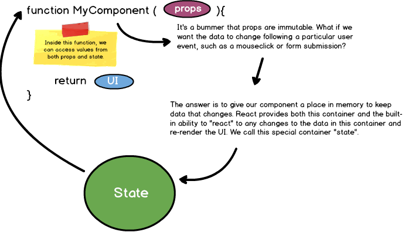

# React

Start:
```
npm init -y
npm install --save react react-dom
```
| Keyword               | Definition                                                                                                                                                                                                                          |
| --------------------- | ----------------------------------------------------------------------------------------------------------------------------------------------------------------------------------------------------------------------------------- |
| React                 | The React object is what's going to allow us to create objects that'll eventually become DOM nodes.                                                                                                                                 |
| React.createElement() | The createElement() method returns the foundational building block of the React library: the React "Element". <br>`React.createElement("h1", {style: {color: "red"}, className:"header"}, "Hello React");`                              |
| React.Component       | A "Component" in React is essentially a configurable, and reusable piece of UI. They can be as simple as a function you write that returns a React "Element", or - optionally - a class you define that extends the React.Component |
| ReactDOM              | React on its own is designed to be just a library for building User Interfaces, and can be plugged into various platforms (ie. web, mobile applications, desktop applications, etc).                                                |
| ReactDOM.render()     | This method is where we plug our React application into an HTML document. It takes two main arguments: a React Element, and a pointer to an HTML DOM node where your React Element is to be rendered.                               |
| React.createElement   | The React element takes 3 arguments: type, props, children. Calling the function returns a React element-- an object that describes the type of DOM node that will eventually be rendered to the browser.                           |

| Command | Action |
| ------- | ------ |
|    create-react-app app-name     |   Projects built with create-react-app come pre-loaded with an array of commonplace React tooling, most notably the ability to make use of modern javascript versions. Not only will we be able to make use of es2015/es2016, etc, we will be able to use jsx syntax, which enables us to write embedded html-like syntax into our React code      |

## Project Structure

```
├── your-app // notable files highlighted
    ├── public
    │   ├── index.html // contains entry-point DOM node
    │   └── images
    ├── src // your react code will go here
    │   └── index.js // ReactDOM.render() call goes here
    └── node_modules
         └── // node packages
```

#### Further Organization

```
└── your-app
    └── src 
        ├── index.js
        └── components 
            ├── App.js 
            ├── App.css 
            └── Title.js
```

## How to Run

1. Delete contents of ./src
2. 
```JSX
import ReactDom from 'react-dom';
import React from 'react';
// babel
const Element1 = React.createElement("h1", null, "Hello React");
// jsx
const Element1 = <h1>Hello React</h1>;

// arrow function
const Element2 = () => {
    return (React.createElement("h1", null, "Hello React");)
}
ReactDom.render(Element1, document.getElementById("root"));
ReactDom.render(Element2(), document.getElementById("root"));
ReactDom.render(<Element2 />, document.getElementById("root"));
```
3. npm start -> localhost:3000

### Components

* A component is just a function that takes data and returns UI.

```JSX
function(data) {
    // Logic that reads data and prepares the UI to return
    return UI
}
```

```JSX
const HeaderComponent = (props) => {
    return <h1>Hello World!</h1>;
     
    // equivalent to :
    // return React.createElement('h1', null, 'Hello Everyone!');
}
```
* The variable name is uppercase. That's a requirement of any React component that we create
* Components such as these are referred to as Functional Components, or Stateless Components.

### Nested JSX Elements

* First, we will need to use a "div" element - or some other HTML element that is nestable ("ul", "header", etc) - as the parent container.
* Second, we will need to wrap the entire JSX expression in parens.

```JSX
// import React, ReactDOM statements
copy

const App = (props) => {
    return (
        <div>
            <h1>Hello Everyone</h1>
            <p>Okay lets go!</p>
        </div>
    );
}
ReactDOM.render(<App />, document.getElementById("root"));
// equivalent to:
// ReactDOM.render(App(), document.getElementById("root"));
```

### Module Export

At the bottom of your component files, you will want to add a default export ComponentName statement. 

```JSX
// /src/TestModule.js
import React from 'react';
const TestModule = (props) => {
    return <h1>This is a TestModule!</h1>;
};
export default TestModule;
```

### Module Import

To import a module, you will use an import statement at the top of your file. This is much like how you are importing the React library. 

```JSX
// /src/App.js
import React from 'react';
 
import TestModule from './TestModule'; // we can drop the .js file extension
import './App.css';
const App = (props) => {
    return (
        <div>
            <h1>Here's our fancy App.</h1>
            <p>Hey pretty cool!</p>
            <TestModule />
            <TestModule />
            <TestModule />
        </div>  
    );
};
export default App;
```

## Props

props is how data flows from a parent to child component in React. 

```JSX
// /src/index.js
import ReactDom from 'react';
 
import TestModule from './TestModule'; // we can drop the .js file extension

const props = {
    title: "Test Title",
    description: "Test Description"
}
ReactDom.reder(TestModule(props), document.getElementbyId("root"));
ReactDom.reder(<TestModule title="React" description="New Description" />, document.getElementbyId("root"));
```

```JSX
// /src/TestModule.js
import React from 'react';
const TestModule = (props) => {
    console.log(props);
    return (
        <h1>This is the title: {props.title}!</h1>
        <p>This is the description: {props.description}</p>
        );
};
export default TestModule;
```

example:
```JSX
const Title = (props) => {
    const fWeight = (props.isImportant) ? ="string from-rainbow">"bold" : "normal";
     
    return <h1 style={{color:props.color, fontWeight:fWeight}}>{props.text}</h1>;
    // note the double curly braces here: 
    // the style property needs to be a complete javascript object,
    // and since we are embedding this value, it is also being wrapped in a set of
    // curly braces for JSX
}
 
const App = (props) => {
    return (
        <div>
            <Title text="Title One" color="red" isImportant={true} />
            <Title text="Title One" color="green" isImportant={false} />
            <Title text="Title One" color="orange" isImportant={false} />
        </div>
    )
}
```

## Handling Events

```JSX
const ButtonOne = (props) => {
    return <button onClick={function(){alert("You clicked me!")}}>Click Me!</button>;
}
// Note the anonymous event handler: You will commonly see this done using ES6 arrow syntax
const ButtonTwo = (props) => {
    return <button onClick={()=> alert("You clicked me!")}>Click Me!</button>;
}
// We may also define the handler as a function inside our component
const ButtonThree = (props) => {
    function handleClick() {
        alert("You clicked me!");
    }
    return <button onClick={handleClick}>Click Me!</button>;
}
```

## State

State refers to a collection of data that:
* can change over time
* our code needs to reference to decide what should show up on the screen



```JSX
class App extends React.Component {
    constructor(props){
        super(props);
        this.state = {
            count: 0
        }
    }
    updateCount() {
    	this.setState(prevState => ({
    		count: prevState.count + 1
    	}));
    }
    render(){
        return (
            <div>
                <h1>{this.state.count}</h1>
                <button
                    onClick={ () => this.updateCount() } >
                    +
                </button>
            </div>
        )
    }
}
```

* One of the most important things you can ask yourself as you're developing an app is: What data belongs in state?
* Every stateful component must have a render method, and every render method must return markup (or null)
* In React, native HTML elements always start with a lowercase letter whereas React component names always start with an uppercase letter
* You should always treat your state object as immutable, using setState() as the only means to updating your component's state.

## Component Callbacks

```JSX
// /src/App.js
import React from 'react';
import Animal from './Animal';
class App extends React.Component {
    constructor(props) {
        super(props);
        this.state = { message: "" };
    }
    // custom method for handling callback
    handleMessage(name) {
        const newMessage = `You just pet the ${name}!`;
        this.setState({message: newMessage});
    }
    render() {
        return (
            <div>
                <h1>Petting Zoo!</h1>
                <h3>{this.state.message}</h3>
                <Animal name="Horse" onPetAnimal={(name) => this.handleMessage(name)} />
                <Animal name="Goat" />
                <Animal name="Sheep" />
            </div>
        )
    }
}
export default App;

```
```JSX
// /src/Animal.js
import React from 'react';
const Animal = (props) => {
    return (
        <div>
            <h2>{props.name}</h2>
            <hr/>
            // we can invoke our props.onPetAnimal callback function when this button is clicked
            // by passing the props.name as an argument, we can send that data back to App
            <button onClick={() => props.onPetAnimal(props.name)}>{`Pet the ${props.name}`}</button>
        </div>
    )
}

export default Animal;
```

## Component Lifecycle

* Before it first renders
* Right after it first renders
* When it gets new properties from a parent

As for Ajax calls from a component, there’s really no better time to reach out to a server than right after the component renders (ComponentWillMount)

```JSX
class App extends Component {
	constructor(props) {
  		super(props);
		this.state = {
	  		time: new Date().toLocaleTimeString()
		}    	
  	}
    
  	componentWillMount(){
		setTimeout(()=>{
			this.setState({time: new Date().toLocaleTimeString()})
		}, 2000);
	}
    
  	render(){
		return (
			<div>
				<h1>{this.state.text}</h1>
			</div>
		)
	}
}
```

## List and Keys

With an array of HTML elements we can render the list.

### keys

Keys help React identify which items have changed, are added, or are removed. The list will still render without using a key, but if the list of users is updated, updating that list will run much slower. 


```JSX
render(){
let users = ["eddy", "brendan", "goose", "eli", "marcos"];
// how to make <li> items dynamically
let userList = this.props.users.map((user, index) => {
    return <li key={index}>{user}</li>
}) 
let userList = [`<li>eddy</li>`,`<li>brendan</li>`,`<li>goose</li>`,`<li>eli</li>`, `<li>marcos</li>`];
    return(
        <div className="container">
            <List users={users} />
        </div>
        <ul>
            {userList}
        </ul>
    )
}
```

## Resources

**[React](https://reactjs.org/docs/create-a-new-react-app.html)**  
**[Conditional Rendering](https://reactjs.org/docs/conditional-rendering.html)**  