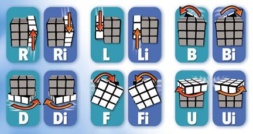

# Rubik's Cube

**[3x3 Solution](https://www.youcandothecube.com/solve-it/3-x-3-solution)**

| Letter | Face       | Side                    |
| ------ | ---------- | ----------------------- |
| R      | Right Face | Right side of the cube  |
| L      | Left Face  | Left side of the cube   |
| U      | Up Face    | Top side of the cube    |
| D      | Down Face  | Bottom side of the cube |
| F      | Front Face | Front side of the cube  |
| B      | Back Face  | Back side of the cube   |

Twisting the Cube: A letter with an “i” after it means an inverted or counter-clockwise move when looking at the face directly

