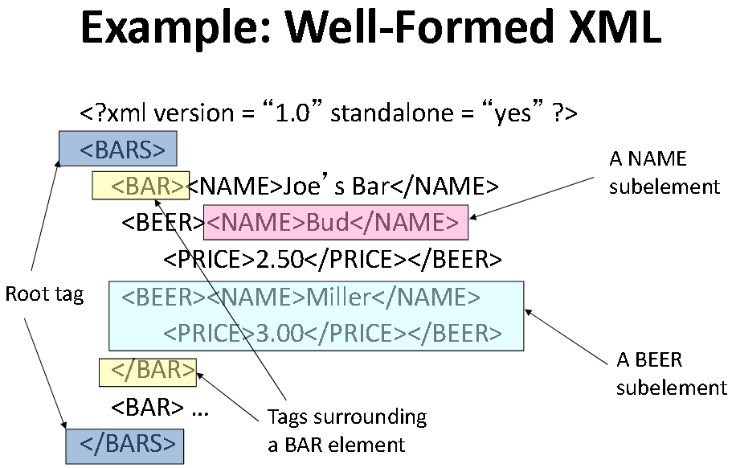
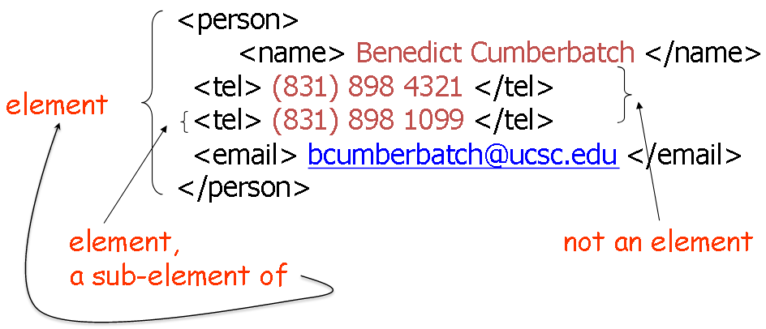

# XML

## Structure

* XML consists of tags and text  
* Tags come in pairs  
  * They must be properly nested  
  * Tags are case-sensitive: `<FOO>...</foo>` does not match
  * Tags are nested arbitrarily
* XML has only one basic type, which is text
* Two ways of representing a database:
  1. Elements intermixed
  2. One element following another
* Consistency of ID and IDREF Attribute Values
  * __ID__ stands for identifier.  The values across all IDs must be distinct
  * __IDREF__ stands for identifier reference.  If an attribute is declared as IDREF, then ...
    * the associated value must exist as the value of some ID attribute (i.e., no dangling "pointers")
    * IDREFS specifies “several” (0 or more) identifiers
    * IDREFs are a lot like Foreign Keys ...except that IDREFs don’t have data types!
* We say that an XML document is __well-formed__ if the document (with or without an associated DTD) has proper nesting of tags and the attributes of every element are all unique
* We say that an XML document x is __valid__ with respect to a DTD D if x conforms to D. That is, if the document x conforms to the regular expression grammar and constraints given by D
* __XML Schema__: An extension of DTDs that allows one to impose a schema or type on an XML document
* Query Languages for XML
  * XPath: Language for navigating through an XML document
  * XQuery:  Query language for XML, similar in power to SQL
  * XSLT:  Language for extracting information from an XML document and transforming it

## Template

* Start the document with a declaration, surrounded by `<?xml... ?>`
* The document starts with a root tag that surrounds nested tags

```HTML
<?xml version = "1.0" standalone = "yes"?>
```

* DTD Structure
  * Document Type Descriptors (DTDs)impose structure on an XML document, much like relation schemas impose a structure on relations
  * The DTD is just a syntactic specification, not a semantic specification

```HTML
<!DOCTYPE <root tag> [
    <!ELEMENT <name>(<components>)>
    . . . more elements . . .
]>
```



| Item            | Definition/Example                                                                                                                                                                                |
| --------------- | ------------------------------------------------------------------------------------------------------------------------------------------------------------------------------------------------- |
| Specify a Tuple | `<person>`<br>&nbsp;&nbsp;&nbsp;`<name>First Last</name>`<br>&nbsp;&nbsp;&nbsp;`<tel>(999) 999 9999</tel>`<br>&nbsp;&nbsp;&nbsp;`<email>firstlast@ucsc.edu</email>`<br>`</person>`                |
| Specify a List  | `<addresses>`<br>&nbsp;&nbsp;&nbsp;`<person> ...</person>`<br>&nbsp;&nbsp;&nbsp;`<person> ...</person>`<br>&nbsp;&nbsp;&nbsp;`<person> ...</person>`<br>&nbsp;&nbsp;&nbsp;`...`<br>`</addresses>` |
Attributes | <ul><li>An (opening) tag may contain attributes.  These are  typically used to describe the content of  an element</li><li>Attributes cannot be repeated within a tag</li></ul>`<entry><br>`<br>&nbsp;&nbsp;&nbsp;`<wordlanguage="en"> cheese </word>`<br>&nbsp;&nbsp;&nbsp;`<wordlanguage="fr"> fromage</word>`<br>&nbsp;&nbsp;&nbsp;`<wordlanguage="ro"> branza</word>`<br>&nbsp;&nbsp;&nbsp;`<meaning>A food made ... </meaning>`<br>`</entry>`<ul><li>Another common use for attributes is to express dimension or type</li></ul>`<picture>`<br>&nbsp;&nbsp;&nbsp;`<height dim= "cm"> 2400 </height>`<br>&nbsp;&nbsp;&nbsp;`<width dim= "in"> 96</width>`<br>&nbsp;&nbsp;&nbsp;`<data encoding= "gif"compression= "zip">M05-.+C$@02!G96YEFEC ...</data>`<br>`</picture>`

The segment of an XML document between an opening and a corresponding closing tag is called an element



## Summary of XML Regular Expressions

Expression | Definition
---|---
A | The tag A occurs
e1, e2 | The expression e1 followed by e2
e* | 0 or more occurrences of e
e? | Optional --0 or 1 occurrences
e+ | 1 or more occurrences
e1 \| e2 | either e1 or e2
(e) | grouping, e.g., `<!ELEMENT Address Street, (City | Zip)>`
